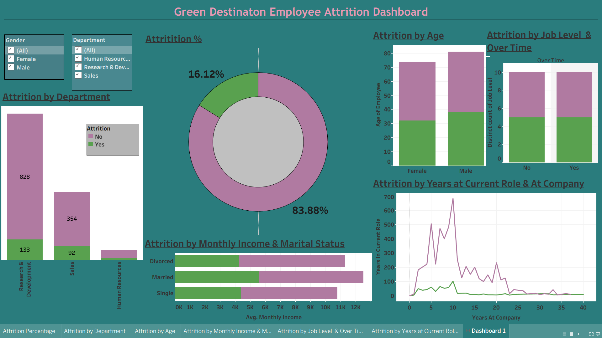

# 📊 Employee Attrition Analysis – Tableau Dashboard

## 🔍 Overview

This project analyzes employee attrition patterns within Green Destination, focusing on identifying key drivers of workforce turnover and presenting them through an interactive Tableau dashboard.

---

## 🎯 Objective

To enable stakeholders to:

* Understand attrition distribution across departments
* Identify employee segments at higher risk of leaving
* Evaluate the impact of compensation and tenure on attrition

---

## 📊 Key Findings

* The overall attrition rate is **16.12%**, indicating a notable level of employee exits.
* **Research & Development** contributes the highest number of attrition cases (133), followed by **Sales (92)**.
* Attrition is more prominent among employees with **lower monthly income**, particularly in the **4K–6K range**.
* Employees in their **early tenure (0–10 years at company)** show higher exit patterns.
* **Single employees** exhibit relatively higher attrition compared to married or divorced groups.
* Gender-based differences exist but are not a dominant factor in attrition.

---

## 📌 Dashboard Features

* Attrition Percentage Overview
* Department-wise Attrition Breakdown
* Attrition by Age & Gender
* Monthly Income vs Marital Status Analysis
* Tenure-based Attrition Trends
* Interactive filters for dynamic exploration

---
## 📸 Dashboard Preview

## 🎥 Interactive Demo

## 🔗 Tableau Dashboard

https://public.tableau.com/views/GreenDestination_17768543550920/Dashboard1

---

## 🛠️ Tools Used

* Tableau (Data Visualization)
* CSV Dataset (HR Data)

---

## 💡 Business Impact

The dashboard helps HR and management teams:

* Identify high-risk employee segments
* Prioritize retention strategies
* Make data-driven workforce decisions

---

## 👤 Author

Sejal Kumari
